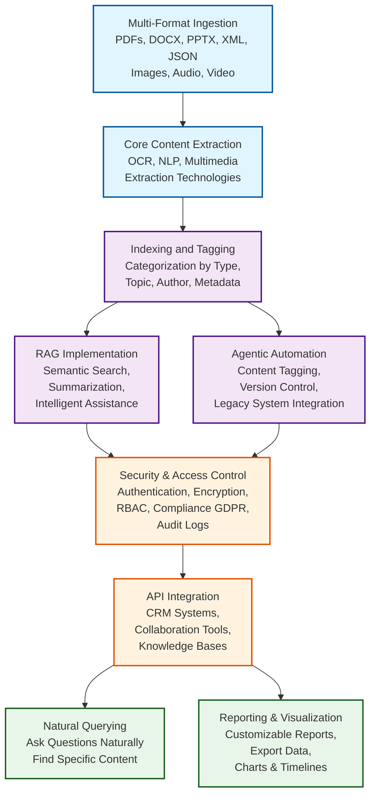

# AI E-Documents POC: ETL Multi-Media to RAG Engine

This repository hosts the **Proof of Concept (POC)** for an AI-powered document intelligence platform, designed as a minimal business version to streamline the processing of diverse, multi-modal documents using a dedicated ETL-to-RAG pipeline. This project uses advanced OCR, RAG, and Agentic AI for broader business and multimedia use cases.

## 🎯 Project Goal and Scope (POC/MVP)

The primary objective is to execute a robust pipeline that converts complex **multi-media resources** via **ETL (Extract, Transform, Load)** methods into a structured knowledge base powered by **Retrieval-Augmented Generation (RAG)**.

**Note:** This is the first stage, intended for **POC/MVP purpose**, and avoids immediate implementation of large-scale, high-cost services like Snowflake, preferring cost-effective alternatives.

---

## 🏗️ Core Processing Pipeline (ETL Workflow)

The system is engineered to handle multiple input formats and accurately parse content through a rigorous three-step process:

1.  **Extraction (E) & Loading:** The platform accepts diverse input formats, including **PDFs, DOCX, PPTX, slides, XML, JSON, images, audio, video, and other multimedia**. Content parsing is achieved using **robust OCR, NLP, and multimedia extraction technologies**.
2.  **Transformation (T):** Extracted data is automatically **categorized, tagged, and indexed** by type, topic, author, or custom metadata. This stage is enhanced with **Agentic AI** to automate complex workflows like content tagging and version control.
3.  **Intelligence Layer (RAG/LLM):** **Retrieval-Augmented Generation (RAG)** is implemented on the processed, indexed documents. This enables precise extraction, validation, **semantic search, summarization**, and intelligent assistance across all content types, eliminating the need for model retraining.

---

## ✨ Key Features

The platform provides high-value user features built upon the integrated data:

*   **Natural Querying:** Enable users to **query documents naturally** (e.g., "find contracts with clause X").
*   **Reporting and Summarization:** Users can generate **customizable reports/summaries** and export data in preferred formats.
*   **Visualization:** Visualize insights through **dynamic charts, timelines, or network graphs** for analyzing trends, usage patterns, and key metrics.
*   **Security:** Enforce robust **authentication, encryption, role-based access controls (RBAC), and compliance features** (e.g., GDPR, audit logs) to protect sensitive documents.
*   **API Integration:** The indexed data supports **seamless API integrations** for internal applications such as CRM, collaboration tools, or knowledge bases.

---

## 🛠️ Technology Stack (POC Focus)

The POC prioritizes open-source and cost-effective solutions:

| Component | Function | Sample Technologies Investigated for POC | Source |
| :--- | :--- | :--- | :--- |
| **Document Ingestion (OCR/Parsing)** | Multi-format content extraction and transcription | Tesseract, PaddleOCR, Unstructured, LangChain loaders | |
| **Multimedia Processing** | Audio and video transcription | Whisper, ffmpeg | |
| **RAG & Agent Frameworks** | Implementing core AI intelligence and automation | LangChain, LlamaIndex, LangGraph | |
| **Vector Databases (MVP)** | Storing and searching vectorized document chunks | Chroma, pgvector, Weaviate | |
| **Data Analysis** | Lightweight analysis of structured data | DuckDB, PostgreSQL (as an alternative to enterprise DW) | |
| **Security/Auth** | Providing RBAC and compliance features out-of-the-box | Supabase Auth, Keycloak, Auth0 | |
| **Frontend** | Rendering data visualizations and user interface | Frontend libraries for data visualization (Dynamic Charts, Network Graphs) |, |

---

## Workflow Diagram

## Codes

Coming soon.