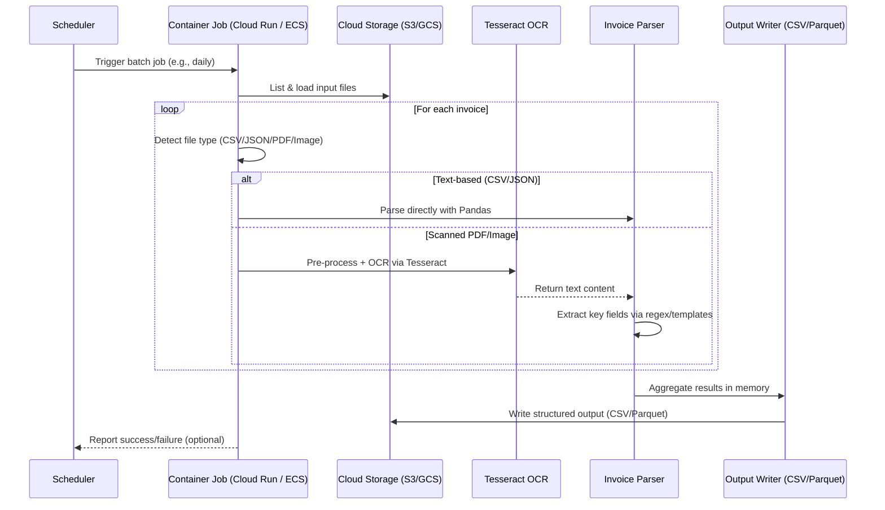
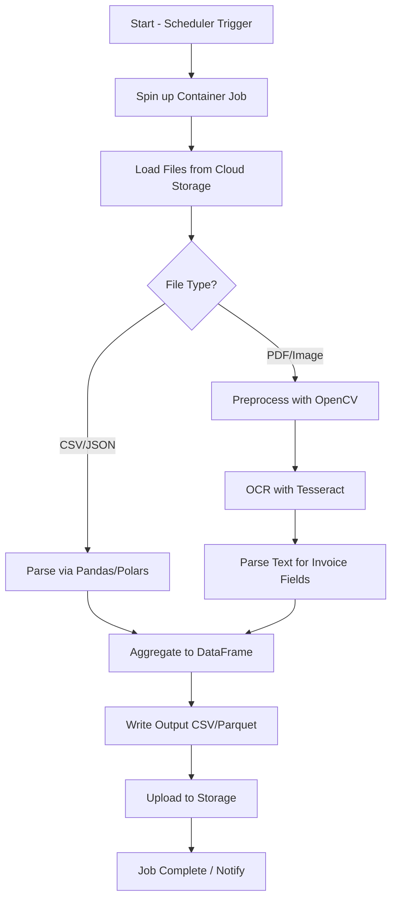

```mermaid
sequenceDiagram
    participant Scheduler
    participant CloudContainer as Container Job (Cloud Run / ECS)
    participant Storage as Cloud Storage (S3/GCS)
    participant OCR as Tesseract OCR
    participant Parser as Invoice Parser
    participant Output as Output Writer (CSV/Parquet)

    Scheduler->>CloudContainer: Trigger batch job (e.g., daily)
    CloudContainer->>Storage: List & load input files
    loop For each invoice
        CloudContainer->>CloudContainer: Detect file type (CSV/JSON/PDF/Image)
        alt Text-based (CSV/JSON)
            CloudContainer->>Parser: Parse directly with Pandas
        else Scanned PDF/Image
            CloudContainer->>OCR: Pre-process + OCR via Tesseract
            OCR-->>Parser: Return text content
            Parser->>Parser: Extract key fields via regex/templates
        end
    end
    Parser->>Output: Aggregate results in memory
    Output->>Storage: Write structured output (CSV/Parquet)
    CloudContainer-->>Scheduler: Report success/failure (optional)

```

```mermaid

flowchart TD
    A[Start - Scheduler Trigger] --> B[Spin up Container Job]
    B --> C[Load Files from Cloud Storage]
    C --> D{File Type?}
    D -->|CSV/JSON| E[Parse via Pandas/Polars]
    D -->|PDF/Image| F[Preprocess with OpenCV]
    F --> G[OCR with Tesseract]
    G --> H[Parse Text for Invoice Fields]
    E --> I[Aggregate to DataFrame]
    H --> I
    I --> J[Write Output CSV/Parquet]
    J --> K[Upload to Storage]
    K --> L[Job Complete / Notify]

```

