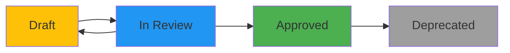

# AgenticOmni Documentation

**Maintained by**: Development Team  
**Repository**: `/docs`  
**Version Control**: Semantic Versioning (MAJOR.MINOR.PATCH)

---

## 📚 Documentation Index

This directory contains all technical and architectural documentation for the AgenticOmni project. All documents follow semantic versioning and change tracking.

### Core Documentation

| Document | Current Version | Last Updated | Purpose |
|----------|----------------|--------------|---------|
| [implementation-summary.md](./implementation-summary.md) | 1.0.0 | 2026-01-09 | Complete implementation overview with diagrams |
| [VERSIONING_GUIDE.md](./VERSIONING_GUIDE.md) | 1.0.0 | 2026-01-09 | Quick reference for documentation versioning |
| [VERSION_CONTROL_SUMMARY.md](./VERSION_CONTROL_SUMMARY.md) | 1.0.0 | 2026-01-09 | Version control system implementation summary |
| [CHANGELOG.md](./CHANGELOG.md) | - | 2026-01-09 | Documentation change history |
| [1-notebooklm-setup.md](./1-notebooklm-setup.md) | 1.0.0 | - | Architecture blueprint and module design |
| [2-chatgpt-setup.md](./2-chatgpt-setup.md) | 1.0.0 | - | ETL workflow diagrams |
| [requirements-1.md](./requirements-1.md) | 1.0.0 | - | Business and technical requirements |

### Reference Documents

| Document | Version | Purpose |
|----------|---------|---------|
| [Project_Gemini_Technical_Blueprint.pdf](./Project_Gemini_Technical_Blueprint.pdf) | - | Complete system design (PDF) |
| [chatgpt-tech-stack.pdf](./chatgpt-tech-stack.pdf) | - | Technology stack decisions (PDF) |

---

## 📋 Document Versioning Strategy

### Semantic Versioning

All documentation follows **Semantic Versioning 2.0.0**:

```
MAJOR.MINOR.PATCH

MAJOR: Breaking changes or complete rewrites
MINOR: New sections, significant additions
PATCH: Bug fixes, typos, clarifications
```

### Version Header Template

Every versioned document must include this header:

```markdown
---
title: "Document Title"
version: "1.0.0"
date: "YYYY-MM-DD"
authors: ["Author Name"]
reviewers: ["Reviewer Name"]
status: "draft" | "review" | "approved" | "deprecated"
changelog: "./CHANGELOG.md#version-100"
---
```

### Document Status Lifecycle



| Status | Description | Who Can Edit |
|--------|-------------|--------------|
| **draft** | Work in progress, not reviewed | Authors |
| **review** | Ready for peer review | Authors + Reviewers |
| **approved** | Reviewed and production-ready | Restricted (requires new version) |
| **deprecated** | Outdated, replaced by newer version | Read-only |

---

## 🔄 Change Management Process

### 1. Making Changes

```bash
# 1. Create a new branch
git checkout -b docs/update-implementation-summary

# 2. Update the document
# - Increment version in header
# - Add changes to CHANGELOG.md
# - Update "Last Updated" date

# 3. Commit with semantic message
git commit -m "docs: update implementation summary to v1.1.0 - add Docker troubleshooting"

# 4. Create pull request for review
```

### 2. Version Increment Guidelines

| Change Type | Example | Version Change |
|-------------|---------|----------------|
| **Typo fix** | Fix spelling errors | 1.0.0 → 1.0.1 |
| **Clarification** | Add missing code example | 1.0.0 → 1.0.1 |
| **New section** | Add "Troubleshooting" section | 1.0.0 → 1.1.0 |
| **New diagram** | Add architecture diagram | 1.0.0 → 1.1.0 |
| **Complete rewrite** | Restructure entire document | 1.0.0 → 2.0.0 |
| **Breaking change** | Change API structure | 1.0.0 → 2.0.0 |

### 3. CHANGELOG Entry Format

```markdown
## [1.1.0] - 2026-01-10

### Added
- New "Troubleshooting" section with common issues
- Docker networking diagram

### Changed
- Updated database schema diagram to include new index
- Improved configuration examples

### Fixed
- Corrected PostgreSQL version number (15 → 16)
- Fixed broken link to API specification

### Deprecated
- Old authentication flow (replaced in v2.0.0)
```

---

## 📝 Document Templates

### Creating New Documentation

Use these templates when creating new documentation:

#### Technical Document Template

```markdown
---
title: "Document Title"
version: "1.0.0"
date: "2026-01-09"
authors: ["Your Name"]
reviewers: []
status: "draft"
changelog: "./CHANGELOG.md#document-title"
---

# Document Title

**Version**: 1.0.0  
**Date**: January 9, 2026  
**Status**: Draft

---

## 📋 Overview

Brief description of what this document covers.

---

## Table of Contents

- [Section 1](#section-1)
- [Section 2](#section-2)

---

## Section 1

Content here...

---

## Version History

| Version | Date | Changes | Author |
|---------|------|---------|--------|
| 1.0.0 | 2026-01-09 | Initial draft | Your Name |

---

*Last updated: 2026-01-09*
```

#### Architecture Decision Record (ADR) Template

```markdown
---
title: "ADR-XXX: Decision Title"
version: "1.0.0"
date: "2026-01-09"
authors: ["Your Name"]
status: "proposed" | "accepted" | "rejected" | "superseded"
---

# ADR-XXX: Decision Title

**Status**: Proposed  
**Date**: 2026-01-09  
**Deciders**: Team members involved

---

## Context

What is the issue we're facing?

## Decision

What did we decide?

## Consequences

What are the positive and negative outcomes?

## Alternatives Considered

What other options did we evaluate?

---
```

---

## 🔍 Finding Documentation

### By Topic

- **Architecture**: `implementation-summary.md`, `1-notebooklm-setup.md`
- **Setup & Installation**: `../README.md`, `../specs/001-app-skeleton-init/quickstart.md`
- **API Reference**: `implementation-summary.md#api-architecture`, `../specs/001-app-skeleton-init/contracts/`
- **Database**: `implementation-summary.md#database-schema`, `../specs/001-app-skeleton-init/data-model.md`
- **Development**: `implementation-summary.md#development-workflow`

### By Version

```bash
# View document history
git log --follow docs/implementation-summary.md

# Compare versions
git diff v1.0.0 v1.1.0 -- docs/implementation-summary.md

# Checkout specific version
git checkout v1.0.0 -- docs/implementation-summary.md
```

---

## 🎯 Documentation Standards

### Writing Guidelines

1. **Clarity**: Write for your audience (developers, stakeholders, users)
2. **Conciseness**: Be brief but complete
3. **Structure**: Use consistent headings and formatting
4. **Visuals**: Include diagrams, tables, code examples
5. **Examples**: Provide real, working examples
6. **Links**: Reference related documents

### Technical Writing Best Practices

- Use present tense ("The system processes..." not "The system will process...")
- Use active voice ("The API returns..." not "The result is returned...")
- Define acronyms on first use
- Use code blocks with syntax highlighting
- Include prerequisites and assumptions
- Provide expected output for commands
- Link to related documentation

### Diagram Standards

- Use **Mermaid** for version-controlled diagrams
- Provide alt text for accessibility
- Keep diagrams simple and focused
- Use consistent colors and styling
- Label all nodes and connections

---

## 🔧 Maintenance

### Regular Updates Required

| Document | Update Frequency | Trigger |
|----------|-----------------|---------|
| implementation-summary.md | After major features | New phase completion |
| CHANGELOG.md | Every change | Any documentation update |
| API specifications | API changes | New/modified endpoints |
| Database schema | Schema changes | Alembic migrations |
| Configuration | Setting changes | New environment variables |

### Review Schedule

- **Weekly**: Check for outdated links and broken references
- **Monthly**: Review documentation structure and organization
- **Quarterly**: Audit for deprecated content
- **Per Release**: Update version numbers and changelogs

### Ownership

| Document Category | Owner | Reviewers |
|------------------|-------|-----------|
| Architecture | Tech Lead | Senior Developers |
| API Documentation | Backend Team | QA Team |
| Setup Guides | DevOps | All Developers |
| User Guides | Product Team | Support Team |

---

## 📊 Documentation Metrics

### Quality Indicators

- ✅ All documents have version headers
- ✅ CHANGELOG.md is up-to-date
- ✅ No broken internal links
- ✅ Code examples are tested and working
- ✅ Diagrams are current with architecture
- ✅ All documents have last updated dates

### Review Checklist

- [ ] Version number incremented correctly
- [ ] CHANGELOG.md updated
- [ ] All links tested
- [ ] Code examples verified
- [ ] Diagrams match current architecture
- [ ] Grammar and spelling checked
- [ ] Peer reviewed and approved

---

## 🤝 Contributing to Documentation

### How to Contribute

1. **Find what needs updating**: Check issues or CHANGELOG
2. **Create a branch**: `docs/update-<document-name>`
3. **Make changes**: Follow versioning guidelines
4. **Update CHANGELOG**: Document your changes
5. **Submit PR**: Request review from document owner
6. **Address feedback**: Iterate based on reviews
7. **Merge**: Once approved

### Documentation Issues

Report documentation issues with:
- Document name and version
- Section/heading where issue is found
- Description of the problem
- Suggested fix (if applicable)

---

## 📞 Questions?

- **Documentation Issues**: Create a GitHub issue with `docs` label
- **Clarifications**: Ask in team chat or code review
- **Major Changes**: Discuss in architecture review meetings

---

## 🔗 Related Resources

- [Main Project README](../README.md)
- [Specifications Directory](../specs/)
- [API Contracts](../specs/001-app-skeleton-init/contracts/)
- [Mermaid Documentation](https://mermaid.js.org/)
- [Semantic Versioning Spec](https://semver.org/)

---

**Last Updated**: January 9, 2026  
**Maintained By**: Development Team  
**Questions**: See team documentation channel
