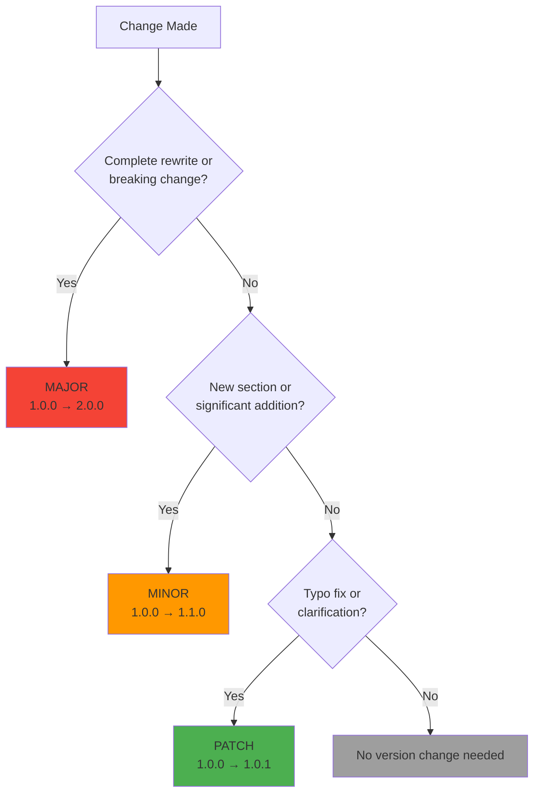

# Documentation Versioning Quick Reference Guide

**Version**: 1.0.0  
**Last Updated**: January 9, 2026  
**Status**: Approved

---

## 🚀 Quick Start

### For New Documents

```bash
# 1. Copy template
cp docs/templates/DOCUMENT_TEMPLATE.md docs/my-new-doc.md

# 2. Fill in header information
# Edit the YAML frontmatter at the top

# 3. Write content

# 4. Validate before committing
python scripts/validate_docs.py
```

### For Updating Existing Documents

```bash
# 1. Determine version increment type
# - PATCH (x.x.1): Typos, clarifications
# - MINOR (x.1.0): New sections, diagrams
# - MAJOR (2.0.0): Complete rewrites, breaking changes

# 2. Update version in header

# 3. Add entry to CHANGELOG.md

# 4. Update "Last Updated" date

# 5. Validate
python scripts/validate_docs.py
```

---

## 📊 Version Increment Decision Tree



---

## 📝 Common Scenarios

### Scenario 1: Fix a Typo

```yaml
# OLD
version: "1.2.3"
```

```yaml
# NEW
version: "1.2.4"
```

```markdown
## [1.2.4] - 2026-01-10

### Fixed
- Fixed typo in configuration example (line 45)
```

---

### Scenario 2: Add New Section

```yaml
# OLD
version: "1.2.3"
```

```yaml
# NEW
version: "1.3.0"
```

```markdown
## [1.3.0] - 2026-01-10

### Added
- New "Troubleshooting" section with common issues and solutions
- Added 3 new Mermaid diagrams for error handling flows
```

---

### Scenario 3: Complete Rewrite

```yaml
# OLD
version: "1.2.3"
```

```yaml
# NEW
version: "2.0.0"
```

```markdown
## [2.0.0] - 2026-01-15

### Changed
- Complete restructure of document architecture
- Updated API examples to use new authentication system (BREAKING)
- Migrated from REST to GraphQL examples (BREAKING)

### Removed
- Deprecated authentication methods (removed from v1.x)
```

---

## ✅ Pre-Commit Checklist

Before committing documentation changes, ensure:

- [ ] Version number incremented in YAML frontmatter
- [ ] Date updated in YAML frontmatter
- [ ] "Last Updated" date at bottom of document updated
- [ ] CHANGELOG.md entry added with version and changes
- [ ] Status updated if moving from draft → review → approved
- [ ] All internal links verified (run validation script)
- [ ] Code examples tested and working
- [ ] Mermaid diagrams render correctly
- [ ] Ran validation script: `python scripts/validate_docs.py`
- [ ] No linting errors

---

## 🎯 YAML Frontmatter Reference

### Required Fields

```yaml
---
title: "Full Document Title"           # Document title
version: "1.0.0"                        # Semantic version (X.Y.Z)
date: "2026-01-09"                      # ISO 8601 date (YYYY-MM-DD)
authors: ["Name 1", "Name 2"]           # List of authors
reviewers: []                           # List of reviewers
status: "draft"                         # draft | review | approved | deprecated
changelog: "./CHANGELOG.md#version"     # Link to changelog entry
---
```

### Optional Fields

```yaml
tags: ["architecture", "api"]           # Searchable tags
related: ["./other-doc.md"]             # Related documents
type: "guide"                           # Document type
supersedes: "old-doc-v1.md"            # Deprecated document
---
```

---

## 📋 CHANGELOG Entry Format

### Standard Entry Template

```markdown
## [X.Y.Z] - YYYY-MM-DD

### Added
- New feature or section
- Another addition

### Changed
- Modified section or behavior
- Updated diagram

### Fixed
- Bug fix or correction
- Typo fix

### Deprecated
- Feature marked for removal
- Old section still present but discouraged

### Removed
- Deleted content
- Removed section

### Security
- Security-related change
```

### Real Example

```markdown
## [1.2.0] - 2026-01-15

### Added
- Added "Docker Troubleshooting" section with 10 common issues
- New sequence diagram for authentication flow
- Added environment variable reference table

### Changed
- Updated PostgreSQL version from 15 to 16 throughout document
- Improved code examples with better error handling
- Restructured "Configuration" section for better clarity

### Fixed
- Corrected broken link to API specification (line 234)
- Fixed incorrect command in setup script example
- Typo: "databse" → "database" (3 occurrences)

### Deprecated
- Old authentication method (will be removed in v2.0.0)
```

---

## 🔍 Validation Script Usage

### Basic Validation

```bash
# Validate all documentation
python scripts/validate_docs.py

# Expected output if passing:
# ✅ All documentation is valid!
```

### What It Checks

1. ✅ YAML frontmatter present and valid
2. ✅ Required fields (title, version, date, authors, status)
3. ✅ Version format (X.Y.Z semantic versioning)
4. ✅ Date format (YYYY-MM-DD)
5. ✅ Valid status value
6. ✅ No broken internal links
7. ✅ "Last Updated" timestamp present

### Common Validation Errors

#### Missing Version Header

```
❌ Missing YAML frontmatter (should start with '---')
```

**Fix**: Add version header at top of file

---

#### Invalid Version Format

```
❌ Invalid version format: 1.0 (expected X.Y.Z)
```

**Fix**: Use three-part version: `1.0.0`

---

#### Broken Link

```
❌ Broken link: [API Spec](../specs/001-app-skeleton-init/contracts/health-api.yaml)
```

**Fix**: Verify file path or update link

---

## 🔄 Git Workflow

### Commit Message Format

```
docs: <type>(<scope>): <subject>

<body>

<footer>
```

### Types

- `feat`: New documentation
- `fix`: Documentation corrections
- `update`: Content updates
- `refactor`: Restructuring
- `style`: Formatting only
- `chore`: Maintenance

### Examples

```bash
# Good commit messages
git commit -m "docs: feat(api): add authentication guide v1.0.0"
git commit -m "docs: fix(setup): correct Docker command typo v1.2.1"
git commit -m "docs: update(arch): add new microservices diagram v1.3.0"

# Bad commit messages
git commit -m "update docs"
git commit -m "fix"
git commit -m "added stuff"
```

---

## 📊 Version History Example

Include this table at the end of your document:

```markdown
## 📝 Version History

| Version | Date | Changes | Author |
|---------|------|---------|--------|
| 1.0.0 | 2026-01-09 | Initial release | John Doe |
| 1.0.1 | 2026-01-10 | Fixed typos in section 3 | Jane Smith |
| 1.1.0 | 2026-01-15 | Added troubleshooting section | John Doe |
| 2.0.0 | 2026-02-01 | Complete rewrite with new architecture | Dev Team |
```

---

## 🎓 Best Practices

### DO ✅

- Update version on every meaningful change
- Write clear CHANGELOG entries
- Test all code examples before committing
- Verify links before committing
- Run validation script before push
- Use semantic versioning consistently
- Keep CHANGELOG up-to-date
- Update "Last Updated" date

### DON'T ❌

- Skip version increments for "small" changes
- Forget to update CHANGELOG
- Leave broken links
- Use non-standard version formats (v1.0, 1.0, 1.x)
- Change approved docs without incrementing version
- Commit without running validation
- Mix multiple changes in one version bump

---

## 🔗 Related Resources

### Internal Documentation
- [Documentation Index](./README.md)
- [CHANGELOG](./CHANGELOG.md)
- [Document Template](./templates/DOCUMENT_TEMPLATE.md)
- [ADR Template](./templates/ADR_TEMPLATE.md)

### External Standards
- [Semantic Versioning 2.0.0](https://semver.org/)
- [Keep a Changelog](https://keepachangelog.com/)
- [Conventional Commits](https://www.conventionalcommits.org/)

---

## 📞 Getting Help

**Questions about versioning?**
- Ask in #documentation channel
- See [docs/README.md](./README.md)
- Check [CHANGELOG.md](./CHANGELOG.md) for examples

**Found a bug in validation script?**
- Report issue in GitHub
- See [scripts/validate_docs.py](../scripts/validate_docs.py)

---

## 📝 Version History

| Version | Date | Changes | Author |
|---------|------|---------|--------|
| 1.0.0 | 2026-01-09 | Initial version control guide | Development Team |

---

*This document follows [Semantic Versioning](https://semver.org/) and is maintained according to the [Documentation Standards](./README.md).*

**Last Updated**: January 9, 2026  
**Document Status**: Approved  
**For Full Documentation Guidelines**: See [docs/README.md](./README.md)
