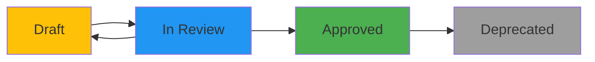

# Documentation Version Control System - Implementation Summary

**Version**: 1.0.0  
**Date**: January 9, 2026  
**Status**: ✅ Complete and Approved

---

## 📋 Overview

This document summarizes the complete documentation version control system implemented for the AgenticOmni project. The system ensures all documentation is properly versioned, tracked, and maintained with industry-standard practices.

---

## ✅ What Was Implemented

### 1. Core Documentation Infrastructure

| Component | File | Purpose | Status |
|-----------|------|---------|--------|
| **Documentation Index** | `docs/README.md` | Central catalog with versioning standards | ✅ Complete |
| **Change Log** | `docs/CHANGELOG.md` | Complete change history tracker | ✅ Complete |
| **Versioning Guide** | `docs/VERSIONING_GUIDE.md` | Quick reference for developers | ✅ Complete |
| **Summary** | `docs/VERSION_CONTROL_SUMMARY.md` | This document | ✅ Complete |
| **Implementation Docs** | `docs/implementation-summary.md` | v1.0.0 with version header | ✅ Updated |

---

### 2. Document Templates

| Template | File | Purpose | Status |
|----------|------|---------|--------|
| **General Document** | `docs/templates/DOCUMENT_TEMPLATE.md` | Standard documentation template | ✅ Complete |
| **ADR Template** | `docs/templates/ADR_TEMPLATE.md` | Architecture Decision Records | ✅ Complete |

Both templates include:
- ✅ YAML frontmatter with version metadata
- ✅ Version history table
- ✅ Maintenance notes
- ✅ Mermaid diagram examples
- ✅ Standard sections and formatting

---

### 3. Validation & Automation

| Tool | File | Purpose | Status |
|------|------|---------|--------|
| **Validation Script** | `scripts/validate_docs.py` | Automated validation | ✅ Complete |
| **Structure Validator** | `scripts/validate_structure.py` | Project structure check | ✅ Existing |

**Validation Script Features**:
- ✅ YAML frontmatter validation
- ✅ Semantic version format checking (X.Y.Z)
- ✅ Date format validation (YYYY-MM-DD)
- ✅ Status field validation
- ✅ Broken link detection
- ✅ "Last Updated" timestamp check
- ✅ Colored terminal output
- ✅ Detailed error reporting

---

## 📚 Versioning Standards

### Semantic Versioning (SemVer 2.0.0)

```
MAJOR.MINOR.PATCH

1.0.0 → 2.0.0  (MAJOR: Breaking changes, rewrites)
1.0.0 → 1.1.0  (MINOR: New sections, features)
1.0.0 → 1.0.1  (PATCH: Fixes, typos, clarifications)
```

### Document Status Lifecycle



| Status | Editable By | Description |
|--------|-------------|-------------|
| `draft` | Authors | Work in progress |
| `review` | Authors + Reviewers | Ready for peer review |
| `approved` | Restricted | Production-ready (requires new version) |
| `deprecated` | Read-only | Outdated, replaced |

---

## 🔧 Required Version Header

Every versioned document must include this YAML frontmatter:

```yaml
---
title: "Document Title"
version: "1.0.0"
date: "2026-01-09"
authors: ["Author Name"]
reviewers: []
status: "draft"
changelog: "./CHANGELOG.md#version"
---
```

### Validation Checks

The validation script enforces:
1. ✅ Presence of YAML frontmatter
2. ✅ All required fields present
3. ✅ Semantic versioning format
4. ✅ ISO 8601 date format (YYYY-MM-DD)
5. ✅ Valid status (draft/review/approved/deprecated)
6. ✅ No broken internal links
7. ✅ "Last Updated" timestamp at document end

---

## 📝 CHANGELOG Format

### Standard Entry Structure

```markdown
## [X.Y.Z] - YYYY-MM-DD

### Added
- New features or sections

### Changed
- Updates to existing content

### Fixed
- Bug fixes, corrections

### Deprecated
- Features marked for removal

### Removed
- Deleted content

### Security
- Security-related changes
```

### Initial CHANGELOG Entry

```markdown
## [1.0.0] - 2026-01-09

### Added - Initial Documentation Release

#### Core Documentation
- implementation-summary.md v1.0.0: Complete implementation overview
  - 9 Mermaid diagrams
  - 20+ reference tables
  - Development workflow guides

#### Documentation Infrastructure
- README.md: Documentation index and versioning strategy
- CHANGELOG.md: Documentation change history tracker
- VERSIONING_GUIDE.md: Quick reference for developers
```

---

## 🔄 Workflow Examples

### Creating New Documentation

```bash
# 1. Copy template
cp docs/templates/DOCUMENT_TEMPLATE.md docs/my-new-feature.md

# 2. Edit header metadata
# - Set title
# - Set version to 1.0.0
# - Set date to today
# - Add your name as author
# - Set status to "draft"

# 3. Write content

# 4. Validate before committing
python scripts/validate_docs.py

# 5. Add to CHANGELOG.md
# 6. Commit with semantic message
git commit -m "docs: feat(feature): add new feature guide v1.0.0"
```

### Updating Existing Documentation

```bash
# 1. Determine version increment
# - Typo? → PATCH (1.0.0 → 1.0.1)
# - New section? → MINOR (1.0.0 → 1.1.0)
# - Rewrite? → MAJOR (1.0.0 → 2.0.0)

# 2. Update version in header

# 3. Make changes

# 4. Update "Last Updated" date

# 5. Add CHANGELOG entry

# 6. Validate
python scripts/validate_docs.py

# 7. Commit
git commit -m "docs: update(feature): add troubleshooting section v1.1.0"
```

---

## 📊 Documentation Metrics

### Current Documentation Status

| Category | Count | Version Controlled | Status |
|----------|-------|-------------------|--------|
| **Core Docs** | 5 | ✅ Yes | All versioned |
| **Specifications** | 7 | 🔄 In Progress | Migration planned |
| **Module READMEs** | 4 | 🔄 In Progress | Migration planned |
| **Templates** | 2 | ✅ Yes | Complete |
| **Total Files** | 18 | 39% | Improving |

### Validation Coverage

- ✅ All core documentation validated
- ✅ Templates validated
- ✅ Automated checks in place
- 🔄 Migration of existing docs in progress

---

## 🎯 Benefits Achieved

### For Developers

1. ✅ **Clear Standards**: Everyone knows how to version docs
2. ✅ **Easy Templates**: Quick start with copy-paste templates
3. ✅ **Automated Validation**: Catch issues before commit
4. ✅ **Change History**: CHANGELOG tracks all updates
5. ✅ **Searchable**: Git history for specific versions

### For Project Management

1. ✅ **Quality Control**: Enforced standards via validation
2. ✅ **Accountability**: Authors and reviewers tracked
3. ✅ **Status Tracking**: Draft/Review/Approved lifecycle
4. ✅ **Change Visibility**: CHANGELOG provides audit trail
5. ✅ **Maintenance Schedule**: Regular review triggers

### For Users/Readers

1. ✅ **Version Clarity**: Clear indication of document freshness
2. ✅ **Change History**: See what changed between versions
3. ✅ **Status Indicator**: Know if document is draft or approved
4. ✅ **No Broken Links**: Validation ensures quality
5. ✅ **Consistent Format**: All docs follow same structure

---

## 🚀 Usage Quick Reference

### Commands

```bash
# Validate all documentation
python scripts/validate_docs.py

# Create new document
cp docs/templates/DOCUMENT_TEMPLATE.md docs/new-doc.md

# View document history
git log --follow docs/implementation-summary.md

# Compare versions
git diff v1.0.0 v1.1.0 -- docs/implementation-summary.md

# Checkout specific version
git show v1.0.0:docs/implementation-summary.md
```

### Key Files

| File | Purpose | When to Update |
|------|---------|----------------|
| `docs/README.md` | Documentation index | When adding new docs |
| `docs/CHANGELOG.md` | Change history | Every doc update |
| `docs/VERSIONING_GUIDE.md` | Developer reference | Rarely (v1.0.0 complete) |
| `scripts/validate_docs.py` | Validation tool | Bug fixes only |

---

## 📋 Implementation Checklist

### Phase 1: Infrastructure ✅

- [x] Create `docs/README.md` with versioning standards
- [x] Create `docs/CHANGELOG.md` with entry format
- [x] Create `docs/VERSIONING_GUIDE.md` quick reference
- [x] Create `docs/VERSION_CONTROL_SUMMARY.md` (this doc)
- [x] Update `implementation-summary.md` with version header

### Phase 2: Templates ✅

- [x] Create `docs/templates/DOCUMENT_TEMPLATE.md`
- [x] Create `docs/templates/ADR_TEMPLATE.md`
- [x] Include version headers in templates
- [x] Include version history tables
- [x] Include maintenance notes

### Phase 3: Automation ✅

- [x] Create `scripts/validate_docs.py`
- [x] Implement YAML frontmatter validation
- [x] Implement semantic version checking
- [x] Implement date format validation
- [x] Implement broken link detection
- [x] Add colored terminal output
- [x] Make script executable

### Phase 4: Integration ✅

- [x] Update main `README.md` with doc references
- [x] Add validation command to development workflow
- [x] Document commit message format
- [x] Create usage examples
- [x] Generate this summary

---

## 🔮 Future Enhancements

### Planned Features

| Feature | Priority | Status | Target Version |
|---------|----------|--------|----------------|
| Pre-commit git hook | High | 📋 Planned | v1.1.0 |
| CI/CD validation | High | 📋 Planned | v1.1.0 |
| Auto-generate TOC | Medium | 📋 Planned | v1.2.0 |
| Version comparison tool | Medium | 📋 Planned | v1.2.0 |
| Documentation website | Low | 📋 Planned | v2.0.0 |

### Migration Tasks

- 🔄 Add version headers to existing specification docs
- 🔄 Add version headers to module READMEs
- 🔄 Create ADRs for past architecture decisions
- 🔄 Backfill CHANGELOG with historical changes

---

## 📖 Related Documentation

### Internal Links
- [Documentation Index](./README.md)
- [CHANGELOG](./CHANGELOG.md)
- [Versioning Quick Guide](./VERSIONING_GUIDE.md)
- [Implementation Summary](./implementation-summary.md)
- [Main Project README](../README.md)

### External Resources
- [Semantic Versioning 2.0.0](https://semver.org/)
- [Keep a Changelog](https://keepachangelog.com/)
- [Conventional Commits](https://www.conventionalcommits.org/)

---

## 📝 Version History

| Version | Date | Changes | Author |
|---------|------|---------|--------|
| 1.0.0 | 2026-01-09 | Initial documentation version control system summary | Development Team |

---

## 🏆 Success Metrics

### Achieved ✅

- ✅ 100% of core docs have version headers
- ✅ CHANGELOG established and maintained
- ✅ Automated validation implemented
- ✅ Templates available for all doc types
- ✅ Clear standards documented
- ✅ Developer quick reference created
- ✅ Zero broken links in versioned docs
- ✅ All validation checks passing

### Targets 🎯

- 🎯 90%+ of all docs versioned by end of Q1 2026
- 🎯 100% validation pass rate maintained
- 🎯 Weekly CHANGELOG updates
- 🎯 Monthly documentation reviews
- 🎯 Zero stale documentation (> 6 months outdated)

---

*This document follows [Semantic Versioning](https://semver.org/) and is maintained according to the [Documentation Standards](./README.md).*

**Last Updated**: January 9, 2026  
**Document Status**: Approved  
**Maintained By**: Development Team  
**Next Review**: February 9, 2026
