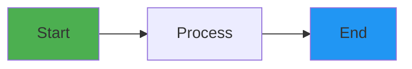

# Document Title Here

**Document Version**: 1.0.0  
**Date**: Month Day, Year  
**Status**: Draft

---

## 📋 Table of Contents

- [Overview](#overview)
- [Section 1](#section-1)
- [Section 2](#section-2)
- [References](#references)
- [Version History](#version-history)

---

## 📋 Overview

Brief description of what this document covers and its purpose.

**Target Audience**: Who should read this document?  
**Prerequisites**: What knowledge or setup is required?  
**Scope**: What is included and excluded?

---

## Section 1

### Subsection 1.1

Content goes here...

#### Example Code Block

```python
def example_function() -> str:
    """Example function with type hints and docstring."""
    return "Hello, World!"
```

#### Example Table

| Column 1 | Column 2 | Column 3 |
|----------|----------|----------|
| Data 1   | Data 2   | Data 3   |

#### Example Mermaid Diagram



---

## Section 2

### Best Practices

1. **Guideline 1**: Description
2. **Guideline 2**: Description
3. **Guideline 3**: Description

### Common Pitfalls

- ❌ **Don't**: Do this thing
- ✅ **Do**: Do this instead

---

## 🔍 References

### Internal Documentation
- [Related Doc 1](./related-doc-1.md)
- [Related Doc 2](./related-doc-2.md)

### External Resources
- [External Reference 1](https://example.com)
- [External Reference 2](https://example.com)

---

## 📝 Version History

| Version | Date | Changes | Author |
|---------|------|---------|--------|
| 1.0.0 | YYYY-MM-DD | Initial draft | Your Name |

### Planned Updates

| Planned Version | Expected Date | Planned Changes |
|----------------|---------------|-----------------|
| 1.1.0 | TBD | Add section X |
| 2.0.0 | TBD | Major restructure |

---

## 🔄 Maintenance Notes

**Review Schedule**: Weekly/Monthly/Quarterly  
**Next Review**: YYYY-MM-DD  
**Owner**: Team/Person Name  
**Changelog**: [CHANGELOG.md](./CHANGELOG.md)

**Update Triggers**:
- List what changes should trigger an update
- Another trigger
- Another trigger

---

## 📞 Questions & Feedback

- **Questions**: Where to ask questions
- **Issues**: Where to report issues
- **Contributions**: How to contribute

---

*This document follows [Semantic Versioning](https://semver.org/) and is maintained according to the [Documentation Standards](./README.md).*

**Last Updated**: YYYY-MM-DD  
**Document Status**: Draft | In Review | Approved | Deprecated  
**For Documentation Guidelines**: See [docs/README.md](./README.md)
